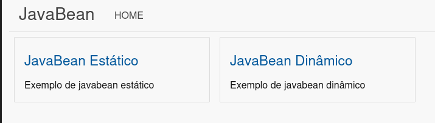
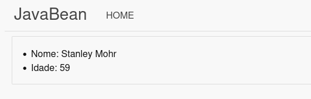
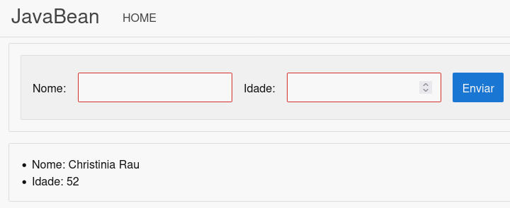

title= JavaBeans
date=2023-11-21
type=post
tags=web,java,jsp,servlet
status=published
~~~~~~

JavaBeans por definição são componentes reutilizáveis e que seguem um conjunto de convenções:

- possui construtor sem argumentos;
- seu atributos encapsulados;
- métodos de acesso a seus atributos.

Existem um conjuntos de tags em JSP que auxiliam na manipulação de JavaBeans.

## Primeiro JavaBean

Abaixo um exemplo de um JavaBean.

```java
package io.github.shifttodev.javabeans.bean;

import com.github.javafaker.Faker;
import lombok.Getter;
import lombok.Setter;

import java.util.Random;

@Getter
@Setter
public class Pessoa {
    private String nome;
    private Integer idade;

    public Pessoa(){
        Faker faker = new Faker();
        this.nome = faker.name().name();
        this.idade = faker.number().numberBetween(18, 80);
    }
}
```

- `Pessoa.java`

## Acessando o JavaBean

Abaixo o código jsp de acesso ao Javabean.

```
<%@ page contentType="text/html;charset=UTF-8" language="java" %>
...
<jsp:useBean id="pessoa" class="io.github.shifttodev.javabeans.bean.Pessoa" />
<ul>
    <li>Nome: <jsp:getProperty name="pessoa" property="nome"/></li>
    <li>Idade: <jsp:getProperty name="pessoa" property="idade"/></li>
</ul>
...
```
- `javabean.jsp`

A tag JSP `<jsp:useBean/>` instância o Javabean, seguindo a seguinte convenção:

- **id**: a identificação atribuída ao Javabean
- **class**: o fqn da classe que representa o Javabean 

Após a instanciação do javabean, para acessarmos suas propriedades utilizamos a tag `<jsp:getProperty/>`, onde:

- **name**: é o identificador do JavaBean
- **property**: o nome do campo do Javabean
 
## Alterando o JavaBean

Para alterar valores do JavaBean, utilizamos a tag `<jsp:setProperty/>`, e da mesma forma do `get`, utilizamos name e property para acessarmos as propriedades do bean.


<br>
## O projeto 

Fiz um pequeno projeto para ilustrar essas funcionalidades do Javabean.

- Criação
- Recuperar valores
- Atribuir valores


*Tela inicial: index.jsp*

- **Bean Estático**: Apesar de criar um bean a cada refresh e atualizar o nome e idade, esse bean não aceita a inserção de informações manualmente


*Bean estático: javabean.jsp*

- **Bean Dinâmico**: Esse bean é criado automaticamente a cada refresh, mas também recebe dados de um _form_. Desta forma, chamamos ele de dinâmico, pois seus valores podem ser alterações dinâmicamente pelos dados recebidos do form.


*Bean Dinâmico: javabean2.jsp*

### Download

- [javabeans](https://github.com/shifttodev/javabeans)