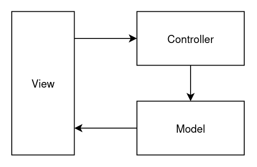

title= MVC/DAO
date=2023-12-05
type=post
tags=web,java,jsp,servlet, mvc
status=published
~~~~~~

_Padrões de projetos são soluções típicas para problemas comuns._ [Refactoring.guru](https://refactoring.guru/pt-br/design-patterns)

Neste projeto, utilizarei dois padrões de projetos muito conhecidos:

- DAO
- MVC

## Data Access Object - DAO

Um padrão que visa abstrair o acesso aos dados. Seu objetivo é possibilitar a mudança da fonte de dados, sem impactar na lógica da aplicação.

Desta forma, é composto por uma camada, geralmente uma interface que define os métodos de acesso aos dados. A implementação desses métodos, poderá mudar conforma a fonte de dados utilizada.

Exemplo: 

```
public interface ILivroDAO {
    boolean inserir(Livro livro);
    boolean deletar(String isbn);
    List<Livro> listar();
    Livro buscarPorISBN(String isbn);
    boolean atualizar(Livro livro);
}
```

Aqui definimos os métodos de acesso, ou seja, os métodos que estão sendo utilizados pelas regras de negócio da aplicação para recuperar os dados. 

A chamada a esses métodos na lógica da aplicação não deveria mudar. Porém, a implementação desses métodos pode mudar a medida que trabalhamos com uma fonte de dados diferente.

## Model View Controller - MVC

O MVC é um padrão de projeto que visa separar uma aplicação em três camadas distintas:

- Modelo: representa os dados da aplicação
- View: apresenta os dados da aplicação
- Controller: representa a ligação entre a view, recebendo os dados da interface do programa, direciona o fluxo das operações, acessando os dados e disponibilizando para as views.

A figura abaixo demonstra uma representação desse padrão:



## O projeto MiniMVC

O projeto Mini MVC é um CRUD que utiliza desses dois padrões em sua implementação. 

- [Mini MVC](https://github.com/shifttodev/mini-mvc)